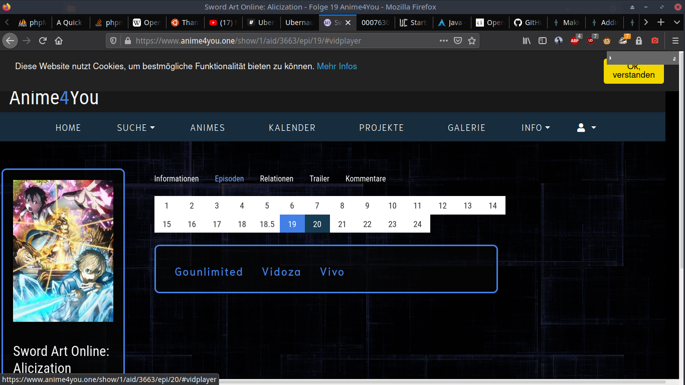
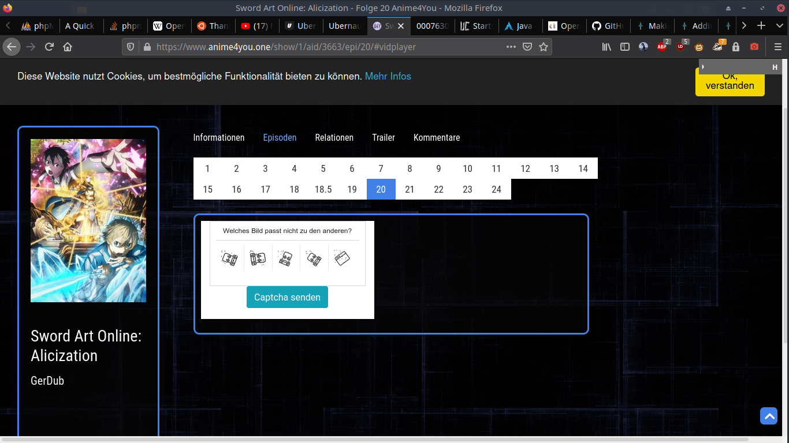
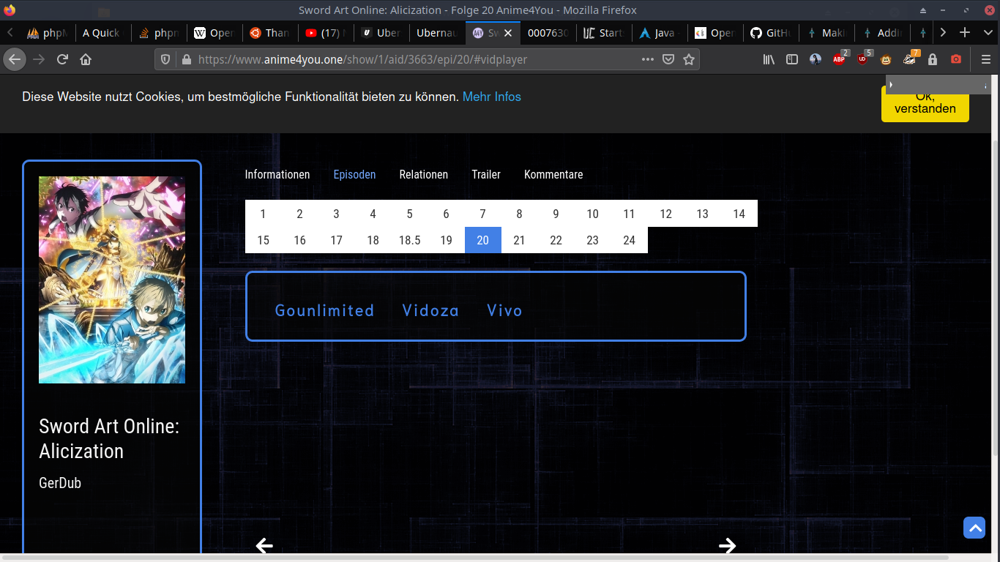
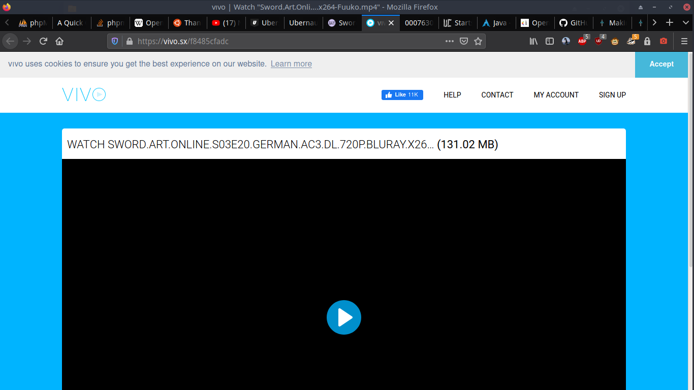
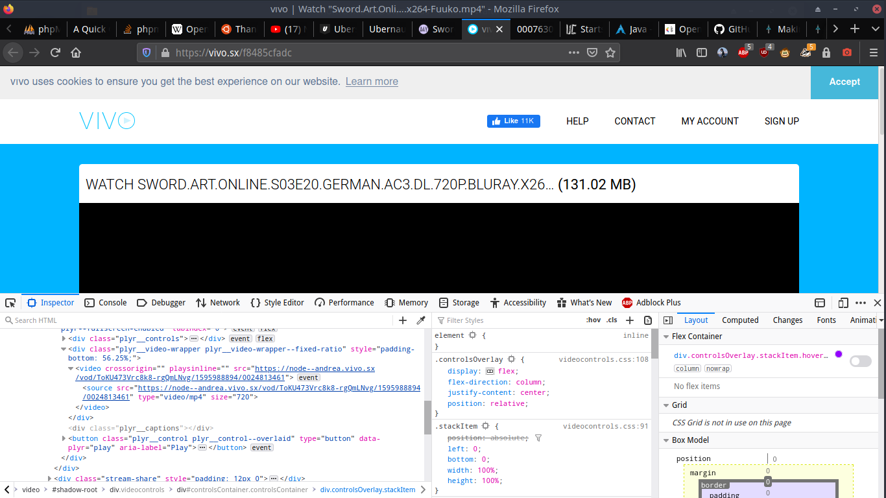
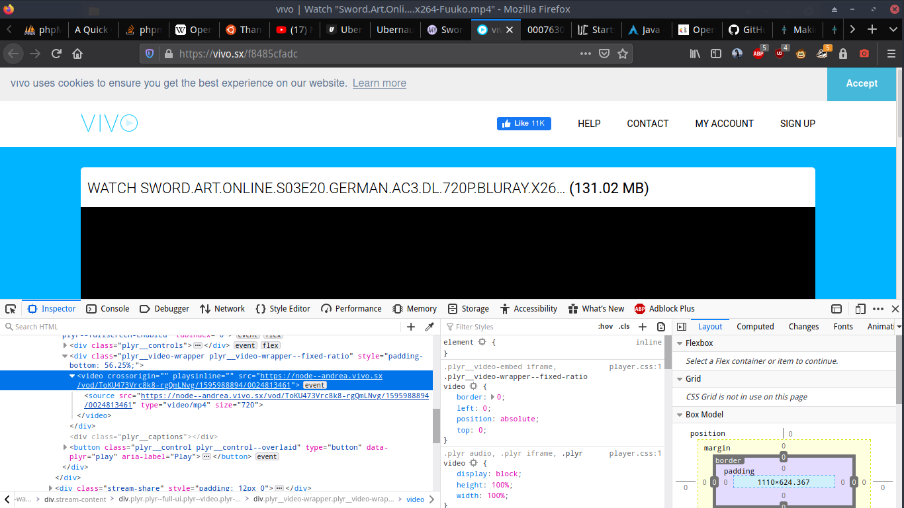
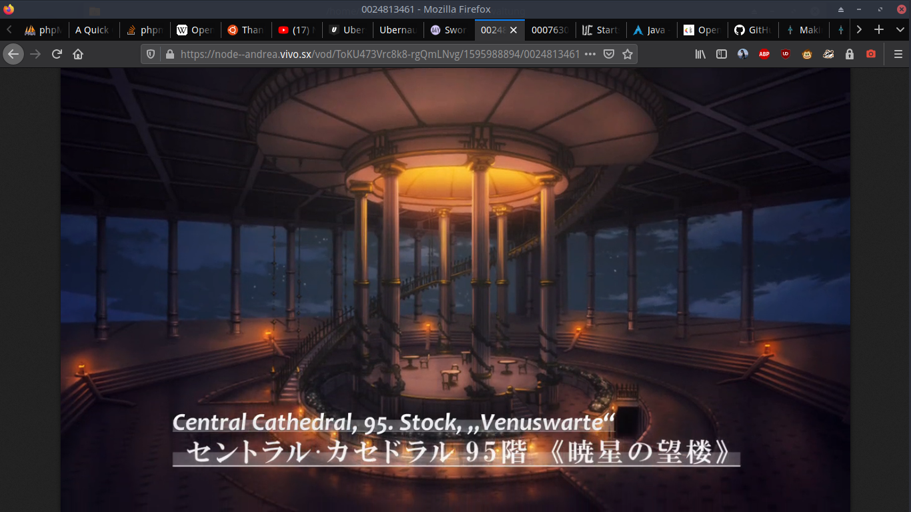

<H1>better Anime4U</H1>

ist eine idee die Seite anime4you.one, für Anime Liebhaber, mit einem Firefox add-on zu verbessern.

 
<h2>Überlegung zur umsetzung</h2>

Ich selber schaue sehr gerne Anime, das Problem ist die Werbung und das ständige rum geklicke zwischen den Folgen wenn das nur leichter wäre

1ter klick die Folgen auswahl, sehr wichtig könnte aber auch einfacher sein zum Beispiel man könnte die Serie auswählen und dann vom letztem Stand weiter gucken.

 

2ter bis 4ter Klick das nervige capcher, vieleich kann man es ja überspringen

 

5ter und 6ter klick den Streaminganbieter auswählen (in meinem fall Vivo)

 

viel zu viel Werbung meist 2 bis 5 klicks zusätslich bis das Video beginnt um die werbung zu umgehen habe ich schon eine Idee, im quelltext gesucht und dann gefunden

 

Hier den Link gefunden, aber vorsicht der ändert sich nach einiger Zeit

 

Und Hier ist der Viedeoplayer der macht nicht alzuviel spaß, man kann vor/zurückspulen via Tasten und Pausieren (aber nur wenn man kurz davor in den player drückt und dann funktioniert das meist auch nicht lange), man kann nicht lauter und leiser stellen via Tasten, also hat dieser Videoplayer überarbeitungs bedarf.

 
<h2>Umsetzung</h2>

Die Umsetzung steht bis jetzt in den Sternen.

 
<h2>Ergebnisse</h2>

Etwa am 10.08.2020 sollte es eine Beta geben

 

Bei ideen einfach rückmelden Danke <3

